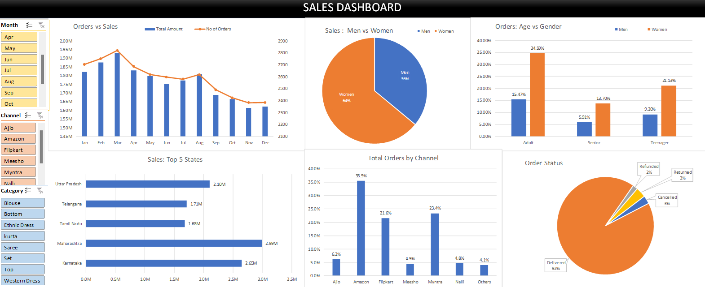

# 📊 Store Sales Analysis

This project focuses on analyzing a store’s sales data using **Microsoft Excel**. Pivot tables and charts were used to extract meaningful business insights, and dashboards were created to visualize the key trends and patterns.

---

##  Business Questions Solved

1. **Order vs Sales Trend** – Monthly order volume trend
2. **Sales by Gender** – Comparison of sales by men vs women
3. **Order Status Breakdown** – Delivered, Cancelled, Returned, Refunded
4. **Top 5 States by Sales** – Which states contributed the most
5. **Order Distribution by Age and Gender** – Teenagers, Adults, Seniors
6. **Order Distribution by Channel** – Amazon, Flipkart, Myntra, etc.

---

## 📷 Dashboard Screenshots

